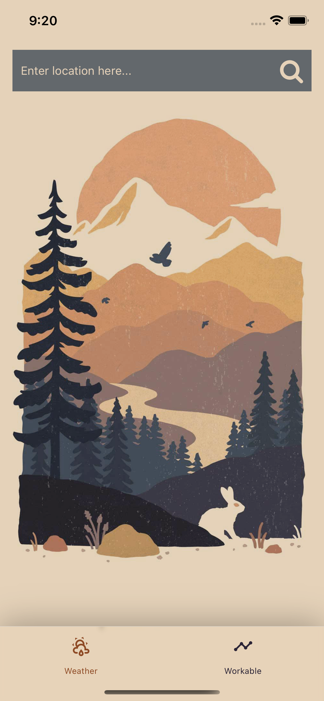
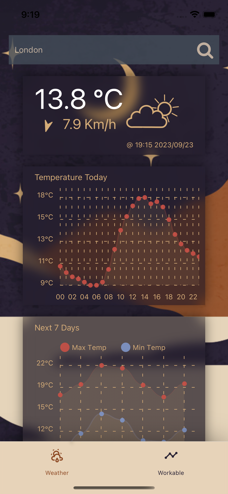
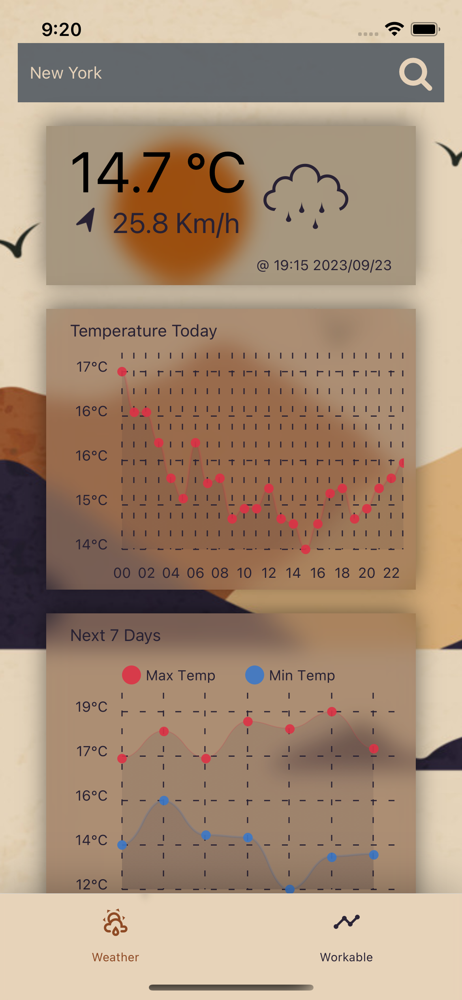
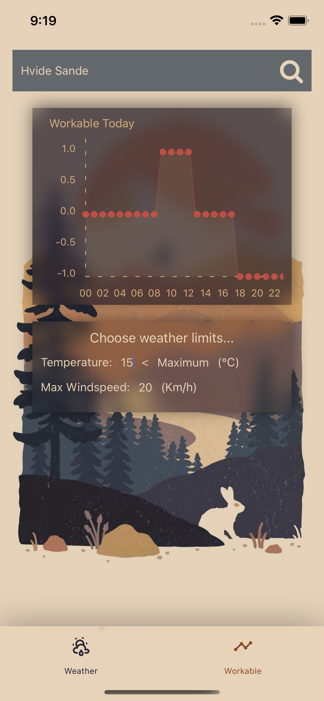

# Workable Weather - Frontend Task

  <!-- iOS -->
  
  <!-- Android -->
  

## 🔮 Description

This is a simple weather app that shows the weather in London, including a detailed graph for temperature over the day and the next 7 days. You can also search for different locations to get the weather all over the world, this was done using GCP Geocoding API. The second page called workable allows a user to pick weather limits, such as a maximum wind speed, and it will tell you what time of the day would fall within these limits. This would be useful for weather dependant any weather dependent activities.

[Showcase Video](Showcase.mov "~1min .mov")

|  |  |  |  |  |
| :--------------------------------------------: | :--------------------------------------------: | :--------------------------------------------: | :--------------------------------------------: | :--------------------------------------------: |
|                   Spash page                   |               Weather in London               |             Weather during the day             |            Weather during the night            |                 Workable page                 |

## 🚀 How to run

- Create a firebase project (don’t worry, it is free) [Firebase Console](https://console.firebase.google.com/)
- Install the firebase [cli](https://firebase.google.com/docs/cli)
- Log in to your google account you created the project with using `firebase login`
- Run `firebase projects:list`
- Copy the `project-id` of the project you created.
- Run `firebase use --add project-id`
- Go to `app/firebase.ts` and change the `firebaseConfig` to that of the firebase project you just created.
- To start the app, run `npm install`, `npm run ios` or `npm run android` from the `/app` folder
- To start the local emulator, run `npm install`, `npm run serve` from the `/functions` folder

### Dependencies

* `expo-blur` - for the blur effect that was used in the design.
* `react-native-svg` - for use of SVG icons of the weather state.
* `react-native-svg-transformer` - for use of SVG icons of the weather state.
* `react-native-chart-kit` - for creating graphs to show the weather over time
